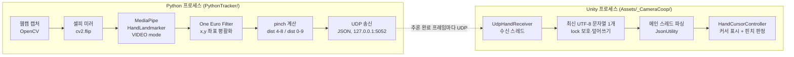

# 01. 아키텍처 개요 — 손 입력과 로컬 릴레이

> 대상: Camera_co-op (웹캠 손동작 기반 3D 협동 드로잉 게임, Steam 출시 목표)
> Phase 1 범위: Python MediaPipe → UDP → Unity 손 커서 + 핀치 감지. 게임 로직 없음.
> 갱신: 2026-09-02. §1~3은 현재 손 입력 경로이며, §6은 Task 14의 현재 4인 Scene 전환 계약이다. 기존 온라인 구현·local RelayQuiz와 구분한다.

## 1. 전체 데이터 흐름



## 2. 프로세스 역할 분리

| | Python (송신) | Unity (수신) |
|---|---|---|
| 책임 | 감지, 평활화, 정규화 좌표 전송 | 수신, 좌표 변환, 표현, 게임 로직 |
| 상태 | seq·손별 One Euro 필터 상태 보유. 프레임별 최신 스냅샷 전송 | 최신 수용 패킷 + lost 판정 상태 보유 |
| 판단 | 하지 않음 (pinch는 raw 값만 전송) | pinch threshold 판정, lost 판정 |
| 좌표계 | 정규화 [0,1], 셀피 미러 뷰 | 화면 픽셀 좌표로 변환 |

원칙: **Python은 센서, Unity는 소비자.** 게임에 관한 판단(threshold, 색, fade)은 전부 Unity 쪽에 둔다. 프로세스 수명은 분리되어 있다. 송신 중단은 Unity의 lost 판정을 일으키며, 마지막 수용 이후 timeout이 지나면 재시작한 seq를 새 세션으로 수용한다.

## 3. 스레드 모델

### Python — 단일 스레드 루프

```
main thread: [capture → flip → infer(VIDEO, 동기) → filter → build JSON → sendto] 반복
```
- 현재는 VIDEO 동기 호출을 포함한 단일 루프다. 고정 주기 제어나 30Hz 보장은 없으며 캡처·추론·후처리 시간에 따라 송신률이 달라진다.
- LIVE_STREAM 전환은 성능 측정 후 검토할 별도 작업이다. 이번 로컬 릴레이 구현에서 Python 추론 구조를 바꾸지 않는다.

### Unity — 수신 스레드 1개 + 메인 스레드

```
recv thread:  UdpClient.Receive (블로킹) → UTF-8 문자열 → lock으로 "최신 문자열 슬롯"에 덮어쓰기
main thread:  Update()에서 슬롯 확인 → JsonUtility 파싱 → seq 검사(역전 폐기) → 커서 갱신
```
- 수신 스레드는 **문자열 저장까지만** 한다. 파싱·판정은 전부 메인 스레드. Unity API의 스레드 제약 문제를 원천 차단한다.
- 큐 대신 최신 1개 슬롯을 쓴다. 커서는 항상 최신 상태만 의미가 있으므로 백로그 누적이 없다.
- 종료: OnApplicationQuit/OnDestroy에서 소켓 Close → 수신 스레드 블로킹 해제 → Join.

## 4. Phase 2 이후 확장 지점

| 확장 | 붙는 위치 | 비고 |
|---|---|---|
| 기존 드로잉 | `HandCursorController` → `HandPointer` → `DrawingController` | 물리 레이캐스트 기반. 현재 End는 정상 해제와 lost 모두에 사용되며 클릭 성공을 뜻하지 않음. [기존 설계](07_phase2_drawing.md) |
| 기존 멀티플레이 | Unity 내부의 `NetSession`·`INetTransport` | UDP는 로컬 센서 전용. 기존 온라인 동작은 이번 범위에서 보존 |
| 제스처 추가 | Python `hand_tracker.py`의 pinch 계산부 옆에 병렬 추가, 프로토콜 `v` 버전 업 | `docs/02_protocol.md` 버전 정책 참조 |
| 성능 개선 | Python LIVE_STREAM 전환, Unity 파싱 GC 절감 | 측정 후 필요 시에만 |

## 5. 로컬 기억 릴레이 설계 경계

아래는 아직 구현하지 않은 Phase D 제안이다. `RelayQuiz.unity`를 새로 만들고 기존 `Netplay3D`·온라인 Relay를 대체하지 않는다. 기존 온라인 Relay는 여러 출제자가 같은 그림을 이어 그리는 게임이며, 여기서 말하는 기억 전달식 릴레이와 규칙이 다르다.

| 계층 | 책임 | 설계 문서 |
|---|---|---|
| PlayerController + InputModeManager | 기존 클래스 재사용, 로컬 CharacterController, Move/Interact와 입력 권한 | [06_player_controller](06_player_controller.md) |
| HandInputRouter + HandInteractable | 새 손 샘플의 hover/down/hold/up/cancel, Overlay 우선 처리 | [07_hand_interaction](07_hand_interaction.md) |
| DrawingController + CanvasDrawingPresenter | 평면 LineRenderer, 스트로크 이력·독립 복사본·읽기 전용 재생 | [08_drawing_canvas](08_drawing_canvas.md) |
| RelayQuizLogic + RelayQuizController | 2~4명 고정 순서, 비밀 표시 정책·타이머·상태 전이·그림 기록 | [09_relay_quiz_mode](09_relay_quiz_mode.md) |

- 로컬 씬은 GameSession·NetSession 없이 동작한다. 데이터와 상태 전이는 향후 동기화할 수 있도록 직렬화 가능한 데이터·순수 로직으로 분리하되 네트워크 구현은 추가하지 않는다.
- UDP v1은 유지한다. 손 UI의 신선도·cancel 사유는 Unity 내부 계약이다.
- 그리기·열람·정답 입력에서는 시점을 고정한다. 갤러리에서 Move로 둘러본다.
- 차례별 그림은 수정되지 않는 복사본으로 보관한다. 그림 숨김과 작업 캔버스 clear를 구분한다.
- 기존 06~09 번호 문서도 보존한다. 문서 참조는 숫자 약칭 대신 전체 파일명으로 구분한다.

Phase D 문서 승인 후 Step 1부터 구현하고, 각 Step 보고·승인 뒤에만 다음 단계로 진행한다. 검증 책임과 Play 체크리스트는 [05_test_plan](05_test_plan.md) §6 이후를 따른다.

## 6. 현재 4인 Scene 전환 아키텍처 (Task 14)

현재 실행 순서는 `CameraToggle`을 mouse로 눌러 camera를 연결한 뒤, 손으로 `Host` 또는 `Invite`를 선택하고 lobby의 자유 연습 상호작용을 거치는 방식이다. 네 player가 각자의 `ReadyPad`에서 준비되면 Host가 `START`를 실행해 `ModeSelectorRoot`를 표시하고, Host가 mode를 선택하면 `SelectModeAndBeginLoad`가 `startSignal`을 증가시켜 additive load를 시작한다.

`PartySceneCoordinator`는 persistent `RelayQuizOnline` lobby owner를 유지하고 선택된 game Scene만 additive load한다. `ModeSelectorRoot`는 lobby에만 있으며, mode Scene에는 Camera, EventSystem, `HandInputRouter`, network owner, `OnlineRelayQuizController`, `TrackerLauncher`를 중복 소유하지 않는다. 선택 가능한 Scene은 `RelayCopy`, `MemoryCopy`, `CoopMural`이다. Host의 `RETURN TO LOBBY`는 game Scene을 unbind·unload한 뒤 lobby를 다시 activate한다.

각 mode의 paper와 tool은 additive adapter에 bind 시 주입한다. `RelayCopy`와 `MemoryCopy`는 owner별 private paper/reference를 사용하며 `CoopMural`은 P1→P2→P3→P4의 공개 mural layer를 순차적으로 freeze한다. paper는 `Docked`로 시작하고 owner가 handle을 들어 `Carried`로 이동한 뒤 자기 zone 중앙에만 다시 dock할 수 있다. paint·width·eraser station과 brush 선택은 pinch, 실제 선은 fist 유지로 처리한다.

camera는 `autoStartCamera=false`인 manual `CameraToggle` 경로다. lobby의 `Explore/Move`는 자유 이동을 유지하고 `Explore/Interact`에서는 active registered lobby paper에 fist drawing을 허용한다. game Drawing context의 이동은 `Carried` canvas일 때만 허용한다. camera와 fresh hand가 준비되면 owner handover가 자동 진행되고, lobby gallery는 deferred 결과 상태를 허용한다.
