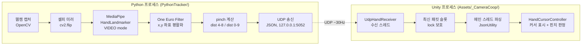

# 01. 아키텍처 개요 — Phase 1 손 추적 입력 파이프라인

> 대상: Camera_co-op (웹캠 손동작 기반 3D 협동 드로잉 게임, Steam 출시 목표)
> Phase 1 범위: Python MediaPipe → UDP → Unity 손 커서 + 핀치 감지. 게임 로직 없음.

## 1. 전체 데이터 흐름



## 2. 프로세스 역할 분리

| | Python (송신) | Unity (수신) |
|---|---|---|
| 책임 | 감지, 평활화, 정규화 좌표 전송 | 수신, 좌표 변환, 표현, 게임 로직 |
| 상태 | 무상태. 프레임 단위로 최신 결과만 전송 | 최신 패킷 + lost 판정 상태 보유 |
| 판단 | 하지 않음 (pinch는 raw 값만 전송) | pinch threshold 판정, lost 판정 |
| 좌표계 | 정규화 [0,1], 셀피 미러 뷰 | 화면 픽셀 좌표로 변환 |

원칙: **Python은 센서, Unity는 소비자.** 게임에 관한 판단(threshold, 색, fade)은 전부 Unity 쪽에 둔다. Python 재시작이 Unity에 영향을 주지 않고, 그 역도 같다.

## 3. 스레드 모델

### Python — 단일 스레드 루프
```
main thread: [capture → flip → infer(VIDEO, 동기) → filter → build JSON → sendto] 반복 (~30Hz)
```
- 30Hz에서 CPU 추론 여유가 충분하므로 스레드 분리를 하지 않는다.
- Phase 2 확장 지점: 프레임 드랍이 문제가 되면 LIVE_STREAM 모드(detect_async + 콜백)로 전환.

### Unity — 수신 스레드 1개 + 메인 스레드
```
recv thread:  UdpClient.Receive (블로킹) → UTF-8 문자열 → lock으로 "최신 문자열 슬롯"에 덮어쓰기
main thread:  Update()에서 슬롯 확인 → JsonUtility 파싱 → seq 검사(역전 폐기) → 커서 갱신
```
- 수신 스레드는 **문자열 저장까지만** 한다. 파싱·판정은 전부 메인 스레드. Unity API의 스레드 제약 문제를 원천 차단한다.
- 큐 대신 최신 1개 슬롯을 쓴다. 커서는 항상 최신 상태만 의미가 있으므로 백로그 누적이 없다.
- 종료: OnApplicationQuit/OnDestroy에서 소켓 Close → 수신 스레드 블로킹 해제 → Join.

## 4. Phase 2 이후 확장 지점

| 확장 | 붙는 위치 | 비고 |
|---|---|---|
| 드로잉 | `HandCursorController`의 public 이벤트 (`OnPinchStart/OnPinchMove/OnPinchEnd`) 구독 | 커서 컨트롤러는 수정 없이 이벤트 소비만 추가 |
| 멀티플레이 | Unity 내부에서 로컬 입력 → Netcode 동기화 계층 | UDP 프로토콜은 로컬 전용으로 유지. 원격 손 데이터는 별도 네트워크 계층이 담당 |
| 제스처 추가 | Python `hand_tracker.py`의 pinch 계산부 옆에 병렬 추가, 프로토콜 `v` 버전 업 | `docs/02_protocol.md` 버전 정책 참조 |
| 성능 개선 | Python LIVE_STREAM 전환, Unity 파싱 GC 절감 | 측정 후 필요 시에만 |
