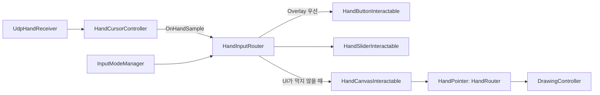

# 07. 손 트래킹 UI 인터랙션 설계

> 작성: 2026-08-28 · 상태: **Step 2·카메라 사용자 확인 · Step 3 구현·자동 검증 반영, 사용자 Play 대기**
> 대상: 로컬 `RelayQuiz.unity`. 기존 UDP v1·온라인 손 입력은 보존한다.
> Step 2의 샘플·라우터·버튼에 이어 Step 3의 캔버스·슬라이더·HandPointer 연결을 구현했다. 기존 자동 레이캐스트 4건과 편집 모드 표시 불안정은 별도로 남긴다.

## 1. 재사용 경계

Phase 1의 HandCursorController는 손바닥 중심을 화면 픽셀 좌표로 바꾸고 `OnPinchStart/Move/End`를 발행한다. 기존 HandPointer는 그 이벤트에서 Physics.Raycast로 ToolButton·CanvasSurface를 찾는다. Step 2는 이 경로를 유지하면서 로컬 uGUI 입력을 추가한다.

- 기존 핀치 비율과 시작 `<0.30`, 해제 `>0.40` 히스테리시스를 재사용한다.
- 기존 End는 정상 해제와 손/server lost를 구분하지 못하므로 새 UI의 클릭 확정에 직접 연결하지 않는다.
- 새 손 샘플은 Unity 내부 계약이다. Python 패킷에 confidence·click·UI 상태를 추가하지 않는다.
- 기존 온라인 경로는 LegacyCursorEvents, 새 로컬 경로는 HandRouter로 명시적으로 분리한다. 한 HandPointer가 두 경로를 동시에 구독하지 않는다.

## 2. 컴포넌트와 입력 흐름

| 파일 / 구현 단계 | 책임 |
|---|---|
| `Assets/_CameraCoop/Scripts/Input/HandCursorController.cs` 수정 | 기존 이벤트 유지, 검증된 새 샘플·취소 이유 제공 |
| `Assets/_CameraCoop/Scripts/Input/HandInputTypes.cs` 신규 | HandInputSample·HandInputState·HandClickContext·HandCancelReason 계약 |
| `Assets/_CameraCoop/Scripts/Input/HandInputRouter.cs` 신규 | UI 우선 히트 검사, 손별 캡처·재무장, 권한·취소 |
| `Assets/_CameraCoop/Scripts/Input/HandInteractable.cs` 신규 | 호버·누름·유지·해제·취소의 공통 추상 컴포넌트 |
| `Assets/_CameraCoop/Scripts/Input/HandButtonInteractable.cs` 신규 | uGUI Button 또는 입력창 선택용 클릭 어댑터 |
| `Assets/_CameraCoop/Scripts/Input/HandUiTestPanel.cs` 신규 | Step 2 A/B/C 버튼의 확인 횟수·문구 표시 |
| `Assets/_CameraCoop/Scripts/Input/HandCanvasInteractable.cs` Step 3 예정 | 현재 작업 캔버스의 핀치 드로잉 어댑터 |
| `Assets/_CameraCoop/Scripts/Input/HandSliderInteractable.cs` Step 3 예정 | uGUI Slider의 손 드래그 어댑터 |
| `Assets/_CameraCoop/Scripts/Input/HandPointer.cs` Step 3 수정 예정 | 입력 경로 선택, 기존 캔버스 이벤트의 로컬 연결 |

새 HandInteractable에는 `HoverEnter`, `HoverExit`, `Press`, `Hold`, `Release`, `Cancel` 수신 계약을 둔다. 인자는 HandInputSample과 현재 히트 위치다. 클릭 가능 여부와 캡처 소유권은 라우터가 판정한다. Cancel은 Release로 변환하지 않는다. 종료된 대상·비활성화된 패널에는 이벤트를 다시 보내지 않는다.

HandInputRouter의 공개 취소 API는 `CancelAll(HandCancelReason reason)`과 `CancelCanvasCaptures(HandCancelReason reason)`이다. 전자는 모든 손 UI·캔버스 캡처를, 후자는 캔버스만 종료한다. 둘 다 해당 손을 재무장 대기로 돌리며 멱등적이다.

| 라우터의 조회·화면 API | 계약 |
|---|---|
| `TryGetHandState(handedness, out HandInputState)` | 마지막 샘플과 계산된 isFresh·isArmed 조회 |
| `HasFreshHand`, `HasArmedHand` | 최소 한 손이 각각 유효·신선하거나 새 down을 받을 준비가 되었는지 |
| `SetViewGeneration(int generation)` | 화면의 세대 번호 설정, 이전 캡처 취소·재무장 초기화 |

Blocked에서도 샘플·신선도·재무장 관찰은 계속한다. 권한은 이벤트를 대상에 전달할지 결정하며 센서 관찰 자체를 끄지 않는다. RelayQuizController는 이 읽기 전용 상태를 사용하고 별도 pinch·신선도 판정기를 만들지 않는다.

버튼의 유일한 확정 이벤트는 `OnHandClick(HandClickContext)`다. context에는 down 시 고정한 `handedness`, `viewGeneration`, `pressSampleId`를 담는다. release 시점의 새 generation으로 바꾸지 않는다. 릴레이 UI는 이를 복사한 action을 controller에 큐잉한다. Button은 시각·interactable 상태용이며 로컬에서 Button.onClick과 별도 콜백을 함께 실행하지 않는다.

## 3. 손 샘플·핀치 계약

HandCursorController의 `OnHandSample`은 새로 수용된 LatestPacket 참조마다 좌·우 샘플을 만들고 손 누락·컴포넌트 종료는 상태 변화 시 한 번 통지한다. 새 수용 여부를 raw seq만으로 판단하지 않는다. 송신 재시작 후 같은 seq가 재등장할 수 있기 때문이다.

로컬 `sampleId`를 새 수용마다 증가시켜 중복 소비를 막는다. 신선도 만료는 HandInputRouter가 마지막 전달 시각과 sampleAgeSeconds로 판정한다. 이벤트가 더 오지 않아도 라우터 Update에서 timeout·취소를 처리하되, 같은 sampleId로 hold·클릭·재무장 시간은 진행하지 않는다.

| HandInputSample 필드 | 의미 |
|---|---|
| `handedness` string | Left 또는 Right |
| `screenPosition` Vector2 | 손바닥 중심, 좌하단 원점의 화면 픽셀 |
| `sequence` uint | 수용된 UDP 패킷 seq. 손 재인식만으로 새 seq를 만들지 않음 |
| `sampleId` ulong | Unity 내부 수용 식별자. UDP seq와 독립적이며 wire에는 전송하지 않음 |
| `sampleAgeSeconds` float | Unity에서 마지막 패킷을 수용한 이후 경과 시간 |
| `isTracked` bool | 유효한 손 데이터와 화면 안 조준점을 가진 새 입력인지 |
| `isPinched` bool | 기존 히스테리시스 결과 |
| `cancelReason` HandCancelReason | 정상 데이터는 None, 입력 무효·종료는 해당 이유 |

`HandCancelReason`은 None, TrackingLost, StaleSample, InvalidSample, ModeChanged, ViewChanged, FocusLost, TargetUnavailable, DrawingCommand, ComponentDisabled다. 정상 pinch up은 None인 추적 샘플에서 pinched가 true→false로 바뀐 경우만 의미한다.

### 유효성·신선도

- `landmarks`는 길이 63, 모든 값은 유한값이어야 한다. pinch도 유한한 0 이상 값이어야 한다.
- 손바닥 길이(0↔9)가 `<1e-6`인 퇴화 입력은 무효다. 현재 Python이 이때 pinch 0을 반환하므로 클릭으로 받지 않는다.
- 손바닥 중심이 화면 [0,1] 밖이면 클릭·드로잉 대상으로 쓰지 않고 현재 캡처를 취소한다. 개별 손끝이 화면 밖이라는 이유만으로 유효한 손바닥을 버리지는 않는다.
- `inputFreshnessSeconds=0.20` 이후 새 수용 샘플이 없으면 StaleSample 취소다. 기존 UDP 서버 lost 0.5초와 목적이 다르며 receiver의 timeout 값은 변경하지 않는다.
- seq는 송신 재시작으로 작아질 수 있다. receiver가 새 세션을 수용한 뒤에는 새 유효 샘플로 처리하되, 기존 캡처는 복구하지 않는다.

### 이벤트와 재무장

| 동작 | 계약 |
|---|---|
| down | 재무장된 손의 새 핀치. 그 시점의 대상 하나만 캡처 |
| hold | 새 수용 샘플에서 핀치 유지. 버튼은 눌림 표현만, 캔버스·슬라이더는 갱신 |
| up | 같은 손의 정상 해제. 버튼은 원래 대상 안에서만 클릭 한 번 |
| cancel | lost·stale·무효·모드/화면 변경·비활성화. 클릭 0회, 드로잉은 마지막 유효 점에서 종료 |

`rearmOpenSeconds=0.10` 동안 연속된 새 유효 샘플 2개 이상에서 손이 펴져야 재무장한다. 샘플 간격이 0.20초를 넘으면 누적을 리셋한다. 최초 시작, cancel, 모드/화면 전환, 포커스 복귀에도 적용한다. hold를 유지한 채 새 화면에 들어와도 버튼이나 그림이 시작되지 않는다.

버튼의 `clickCooldownSeconds=0.15`는 대상별 중복 확정 방지용이다. 한 핀치에서 반복 클릭하지 않으며 cooldown이 끝났다는 이유로 held pinch를 다시 down으로 만들지 않는다. 버튼을 벗어나면 해당 누름을 취소하고, 다시 들어와도 새 핀치가 필요하다.

양손의 hover·드로잉은 독립적이다. 버튼·슬라이더 하나에는 최초 down의 손 하나만 소유권을 준다. 같은 프레임의 동시 down은 Left, Right 순으로 판정한다. 화면 전이를 일으킨 클릭 뒤에는 나머지 손의 이전 화면 입력도 취소한다. 게임 전이는 별도로 상태 세대 번호를 검사한다.

## 4. UI 배치와 레이캐스트

**메뉴·팔레트·타이머·인계·답변은 Screen Space Overlay, 작업 캔버스와 갤러리는 World Space**로 구성한다. Overlay는 거리와 각도에 따라 버튼 크기가 달라지지 않는다. World Space UI만 사용하는 안은 답변 입력과 확실한 차폐가 어려워 채택하지 않는다. [Unity Canvas 문서](https://docs.unity3d.com/Packages/com.unity.ugui@2.0/manual/class-Canvas.html).

1. 손 화면 좌표로 활성 Overlay의 GraphicRaycaster 결과를 정렬한다.
2. 최상위 UI가 HandInteractable이면 그 대상만 처리한다. 비활성 버튼·가림 배경처럼 클릭하지 않는 UI여도 raycast를 막으면 월드 입력을 통과시키지 않는다.
3. UI가 전혀 막지 않고 CanDraw가 true일 때만 지정 카메라의 Physics.Raycast를 수행한다.
4. 맞은 오브젝트의 HandCanvasInteractable과 **실제 CanvasSurface**를 확인한다. 등록된 현재 작업 캔버스 하나만 허용한다.
5. 캔버스를 벗어나거나 중간에 UI가 가리면 선을 끝낸다. 핀치를 유지한 채 돌아와도 이어 그리지 않는다.

커서 Image·커서 라벨·단순 타이머 Text는 raycastTarget=false다. 차폐 패널은 전체 화면에서 raycastTarget=true이며 입력 UI 중 최상위에 둔다. 입력 대상 탐색에 `Camera.main`이나 런타임 Find를 사용하지 않는다. Gallery의 CanvasSurface는 시각 배치에만 쓰고 HandCanvasInteractable을 붙이지 않는다.

`LeftHandCursor`와 `RightHandCursor`에는 각각 중첩 Canvas를 두고 `overrideSorting=true`, `sortingOrder=32767`을 지정한다. OverlayRoot는 100을 유지하고 다른 UI는 커서보다 낮은 순서를 사용해, 팔레트·팝업·차폐 패널 위에서도 양손 커서가 보이게 한다. 커서 Canvas에는 GraphicRaycaster를 붙이지 않으며 기존 CanvasGroup의 `interactable=false`, `blocksRaycasts=false`를 유지한다. 커서 위치·크기·추적 유실 시 fade 동작은 바꾸지 않는다.

### EventSystem·마우스 차단

로컬 씬의 EventSystem과 InputSystemUIInputModule은 uGUI 선택·입력창 생명주기에 사용한다. 기존 `Assets/InputSystem_Actions.inputactions`를 actionsAsset에 먼저 할당하고, Point/LeftClick/RightClick/MiddleClick/ScrollWheel/TrackedDevicePosition/TrackedDeviceOrientation/Move/Submit/Cancel의 개별 action reference는 전부 해제한다. `sendNavigationEvents=false`로 둔다. 공유 asset의 binding 자체는 수정하지 않는다.

설치된 1.19 소스에서 actionsAsset이 null이 아니면 OnEnable의 자동 기본 액션 할당을 피할 수 있고, 선택된 입력창의 updateSelected는 navigation 차단보다 먼저 처리된다. 따라서 asset까지 지우는 UnassignActions로 대체하지 않는다. component 재활성화 뒤에도 개별 action이 비어 있는지 검사한다. 이는 텍스트·IME의 빌드 동작 검증을 대체하지 않는다.

손 어댑터가 표현용 pointer enter/down/up·select 이벤트를 명시적으로 전달한다. 정상 클릭은 OnHandClick 하나로 확정하고 native pointerClick/Button.onClick 경로를 호출하지 않는다. 로컬 버튼의 기존 onClick Inspector 콜백도 비워 중복 경로를 없앤다. 마우스 장치를 손 입력으로 가상 이동시키는 방식은 사용하지 않는다. 마우스 룩과 좌표가 섞일 수 있기 때문이다.

입력창은 HandButtonInteractable의 정상 클릭으로 Select·ActivateInputField한다. 선택된 입력창만 키보드 텍스트·IME를 받는다. Enter와 onEndEdit에는 정답 제출을 연결하지 않는다. IME 조합 중에는 제출 버튼의 down부터 차단해 입력창 포커스를 빼앗지 않고 `글자 조합을 마친 뒤 제출하세요`를 표시한다. 확정·시간 만료·포커스 해제 순서는 [릴레이 설계](09_relay_quiz_mode.md)를 따른다. 에디터와 Windows 빌드에서 각각 검증해야 한다.

## 5. 버튼·슬라이더·드로잉 연결

| 파생 컴포넌트 | 동작 |
|---|---|
| HandButtonInteractable | hover·pressed 표현, 정상 up-inside에서 OnHandClick 1회. 입력창 선택에도 같은 판정 사용 |
| HandSliderInteractable | down에서 손 하나를 캡처하고 hold에서 RectTransform 로컬 X를 값으로 변환. 영역 밖은 양끝으로 제한. up에서 종료, cancel에서 더 갱신하지 않음 |
| HandCanvasInteractable | down/hold/up·cancel을 HandPointer의 캔버스 API로 전달. 평면과 스타일 처리는 DrawingController 책임 |

HandPointer에 직렬화 `inputSource` 선택과 읽기 전용 `InputSource` 속성을 추가한다. 기본 `LegacyCursorEvents`는 기존 구독·레이캐스트를 유지한다. 로컬 `HandRouter`는 기존 cursor 이벤트를 구독하지 않고 아래 예정 메서드만 받는다.

| 예정 API | 기존 이벤트 연결 |
|---|---|
| `BeginCanvasStroke(handedness, surface, normalizedPosition)` | 실제 surface의 잉크 좌표로 변환해 OnCanvasStrokeStart |
| `MoveCanvasStroke(handedness, surface, normalizedPosition)` | 같은 캡처·surface에서만 OnCanvasStrokeMove |
| `EndCanvasStroke(handedness)` | 활성 스트로크가 있으면 OnCanvasStrokeEnd, 반복 종료는 무시 |

HandPointer는 로컬에서 StrokesEnabled를 입력 권한으로만 사용한다. 모든 UI까지 차단하는 플래그로 간주하지 않는다. 공용 입력 허용 여부는 InputModeManager가 결정한다.

팔레트는 기존 ToolState와 ToolButton의 Kind/Index 데이터를 재사용한다. Overlay 버튼의 OnHandClick에서 `ToolState.Apply(ToolButton)`을 한 번 호출한다. ToolState의 기존 월드 선택 위치 이동을 끄기 위해 로컬 `buttons` 배열은 비운다. Step 3에서 읽기 전용 CurrentColorIndex·CurrentWidthIndex를 추가하고 기존 OnChanged와 함께 Overlay 선택 표시를 갱신한다. 기존 Apply·온라인 팔레트 동작은 유지한다.

색 6개와 굵기 3단계는 기존 배열을 사용한다. 굵기 Slider는 min=0, max=2, wholeNumbers=true이며 선택 인덱스에 대응하는 ToolButton을 Apply한다. 브러시 스타일은 stroke 시작 시 고정하므로 다른 손이 도구를 바꿔도 진행 중 선은 변하지 않는다. 픽셀 지우개는 추가하지 않는다.

undo·전체 clear·그림 완료는 손 버튼이다. `CancelCanvasCaptures(DrawingCommand)` → `FinalizeActiveStrokes()` → undo/clear/export 순으로 처리한다. clear는 작업 그림만 지우며 저장된 턴 기록에는 영향을 주지 않는다. 로컬 DrawingController의 `clearKey=Key.None`을 설정한다.

## 6. 시각·청각 피드백

기준 해상도는 1920×1080, CanvasScaler는 Scale With Screen Size와 match=0.5다. 기본 버튼 높이 72px 이상, 버튼 사이 간격 16px, 손 커서 32px를 초기값으로 한다. 1280×720과 16:10에서도 겹침·잘림을 사용자에게 확인받는다.

| 상태 | 시각 | 청각 |
|---|---|---|
| 기본 | 어두운 배경·밝은 글자, 선택 항목 테두리 | 없음 |
| hover | 밝은 테두리와 대상 이름, 손 커서 강조 | 진입당 짧은 hover 음 1회, 0.15초 재생 간격 |
| pressed/hold | 버튼 밝기 감소·0.96배 축소, 누른 손 색 표시 | 추가 반복음 없음 |
| click | 0.12초 확정 강조 후 기본 상태 | click 음 1회 |
| cancel/disabled | 눌림 원복, 비활성 대상은 낮은 대비 | 성공음 없음 |
| tracking lost | 커서 fade, `손을 카메라에 보여주세요` | 반복 경고음 없음 |

AudioSource는 2D(spatialBlend=0), playOnAwake=false, volume=0.2다. Step 2에서 짧은 자체 생성 신호음 `Assets/_CameraCoop/Audio/HandHover.wav`, `Assets/_CameraCoop/Audio/HandClick.wav`를 준비하고 Inspector에 할당한다. 외부 음원·추가 패키지는 필요하지 않다. 상태를 소리나 색 하나에만 의존하지 않는다.

## 7. Inspector 할당 목록

| 오브젝트 / 컴포넌트 | 직접 할당·설정 |
|---|---|
| HandTracking / HandCursorController | receiver, leftCursor, rightCursor; 기존 threshold·fade |
| LeftHandCursor·RightHandCursor / Canvas | overrideSorting=true, sortingOrder=32767, Sorting Layer=Default; GraphicRaycaster 없음 |
| InputRoot / HandInputRouter | cursorController, inputModeManager, playerCamera, eventSystem, 활성 UI raycaster 목록, AudioSource·두 clip·상태 Text. activeCanvas·handPointer는 Step 3 연결 |
| HandInputRouter | inputFreshnessSeconds=0.20, rearmOpenSeconds=0.10, clickCooldownSeconds=0.15, maxDistance=20 |
| DrawingRoot / HandPointer | inputSource=HandRouter, aimCamera, canvasSurface, toolState. Legacy 이벤트 구독은 비활성 |
| 작업 이젤 / HandCanvasInteractable | CanvasSurface, HandPointer, 충돌체. 갤러리에는 부착하지 않음 |
| Overlay 버튼 / HandButtonInteractable | 대상 Button 또는 InputField, hover·pressed Graphic, OnHandClick만 구독; Button.onClick 비움 |
| 굵기 UI / HandSliderInteractable | Slider, ToolState, 3개의 굵기 ToolButton 데이터 |
| 가림 패널 | 최상위 전체 화면, raycastTarget=true, 아래 UI 루트 비활성 |

필수 참조 누락은 오류로 보고하고 해당 입력을 중단한다. MCP로 할당할 수 없는 항목은 정확한 오브젝트/컴포넌트/필드를 사용자에게 전달한다.

## 8. Step 2 완료 기준과 후속 연결

- [ ] 기존 ProtocolTests·PointerRouteTests를 유지한다. 새 샘플 유효성·up/cancel·재무장·양손 캡처 경계는 `Assets/_CameraCoop/Tests/EditMode/HandInteractionTests.cs`로 검증한다.
- [ ] RelayQuiz 씬에 `테스트 A/B/C` 버튼을 배치한다. 각 버튼은 다른 확인 문구와 확정음으로 구분하고, 일반 마우스·Enter·Space로는 실행되지 않는다.
- [ ] 정상 핀치 10회에 클릭 10회, 누른 채 손 숨기기는 0회, 다른 대상으로 이동 후 해제는 0회, 양손 동시 클릭은 한 번만 확인한다.
- [ ] 가림 UI 뒤 캔버스가 입력을 받지 않는 것을 Step 3에서 추가 검증한다.
- [ ] `refresh_unity → read_console` 결과와 사용자 Play 체크리스트를 보고하고 다음 Step 승인을 기다린다.

## 9. Step 2 구현·검증 기록 — 2026-08-28

구현 범위는 샘플 발행, 버튼용 라우터와 어댑터, 확인 횟수 표시, RelayQuiz 테스트 UI다. 캔버스·슬라이더·팔레트·릴레이 상태 전이는 아직 구현하지 않는다.

- 정상 해제만 확정하며 취소는 성공음·확정 cooldown을 남기지 않는다. 내부 `Release` 반환값은 확정 여부이고, 비활성화 revision으로 같은 대상의 재활성화도 새 입력으로 구분한다.
- 입력창 선택 콜백이 대상을 비활성화하거나 파괴하는 회귀를 재현한 뒤 수정했다. 이 다섯 lifecycle 테스트는 RED 후 GREEN을 확인했다. 실제 IME와 답변 화면은 Step 4·5 검증이다.
- 씬에 A/B/C 240×104 버튼, 16px 간격, 32px L/R 커서, 추적·호버 상태 Text와 자체 생성 WAV 두 개를 배치했다. AudioSource는 2D·volume 0.2이며 버튼별 clickPitch는 0.9/1.1/1.3이다.
- Inspector 참조는 전부 할당했다. InputSystemUIInputModule의 actionsAsset은 기존 자산을 유지하고 개별 action 10개는 해제했다. 재활성화·도메인 reload 뒤 저장값도 확인했다. native Button.onClick은 비어 있다.
- 최신 `refresh_unity → read_console`: C# 컴파일 오류 없음. 기존 MCP 재연결 경고와 pipeline 비자동 실행 경고는 남아 있다. 씬 검사에서 missing script와 broken prefab은 0건이다.
- 전체 EditMode **379건 중 375통과, 4실패, skip 0**. 기존 287건은 모두 통과했다. 신규 샘플 30건, 버튼 16건, 라우터 46건 중 42건이 통과했다. [전체 XML](../.omo/evidence/phase2-step2-editmode.xml).
- 에디터 재시작 직후의 기본 1920×1080 화면은 두 독립 검토에서 한글·배치 문제 없이 통과했다. 그러나 마지막 자동 테스트 뒤 Overlay 전체가 보이지 않는 새 관측이 있어 **최종 화면 검증은 미통과**다. 초기 캡처의 승인을 최신 화면 승인으로 재사용하지 않는다.

### 미해결 검증

실제 GraphicRaycaster를 사용하는 네 테스트에서 임시 Canvas의 `Graphic.depth=-1`이 남아 있다. 대기, Game 뷰 활성화, 즉시 네이티브 repaint로도 해결되지 않았다. 마지막 진단에서는 Game 카메라 31회 렌더와 Graphic의 4개 정점·material 1개를 확인했다. 단순 미렌더 가설만으로 설명할 수 없으며 원인은 확정하지 않았다. 실패 테스트는 삭제·skip·완화하지 않았다.

마지막 전체 테스트 뒤에는 실제 RelayQuiz Game 뷰에서도 Overlay가 보이지 않았다. 씬은 변경되지 않았고 모든 루트·참조가 남아 있으며, 전용 MCP로 저장된 씬을 다시 열어도 같은 상태였다. 초기 재시작 직후 캡처에서는 같은 UI가 표시됐다. 현재 에디터 상태와 Play 실행의 차이는 아직 확인하지 않았다.

따라서 **Step 2 전체 검증은 아직 통과가 아니다**. Unity를 재시작한 뒤 [사용자 Play 절차](05_test_plan.md#7-3-step-2-사용자-play-체크리스트)로 A/B/C 표시와 핀치 클릭을 먼저 확인한다. 이 관측은 자동 테스트 실패를 면제하지 않는다. 결과를 받아 남은 검증을 정리하기 전에는 Step 3로 진행하지 않는다.

### 후속 사용자 화면 관측

2026-08-28 사용자가 올린 화면에는 Overlay와 A/B/C, 손 조작 모드 안내가 표시됐다. 따라서 앞선 Overlay 미표시는 이 캡처에서 재현되지 않았다. 핀치 클릭 성공이나 자동 테스트 4건의 해결을 뜻하지는 않는다. 사용자는 이 화면에 캠 시작 버튼이 없음을 지적했다. 기존 `TrackerLauncher`는 NetplayTest·Netplay3D에서 사용하지만 RelayQuiz에는 연결하지 않은 상태다.

## 10. 캠 시작 버튼 보완안 (승인 완료)

아래 내용은 **기존 입력 정책의 승인된 변경안**이다. 2026-08-28 사용자가 “응”으로 카메라 컨트롤만의 마우스 예외와 게임 안 시작·종료 버튼 추가를 승인했다. 실제 카메라는 사용자가 Play에서 버튼을 누를 때만 시작한다.

### 선택지

| 방식 | 특성 |
|---|---|
| 게임 안 `캠 켜기/끄기` 버튼 | 사용자가 켜는 시점을 정한다. 손 추적 시작 전에도 누를 수 있도록 이 컨트롤에만 마우스 예외가 필요하다. 권장안 |
| Play 시작 시 자동 실행 | 시작 클릭이 필요 없지만 Play만으로 카메라가 열린다. 이번 변경안에서는 선택하지 않는다 |
| 외부 터미널에서 실행 | 현재 방식. 게임 안에서 캠을 켜고 싶다는 요구를 해결하지 못한다 |

### 권장안의 입력·표시 계약

- 화면 오른쪽 위에 `캠 켜기/끄기`와 연결 상태를 둔다. 사용자가 버튼을 누르기 전에는 카메라를 자동으로 켜지 않는다.
- **이 카메라 컨트롤의 시작·재시도·종료만 마우스 왼쪽 클릭을 허용한다.** A/B/C, 팔레트, 릴레이 진행·제출은 계속 손 전용이다. Enter·Space·추가 단축키로 카메라를 조작하지 않는다.
- 최초 캠 준비 중에는 입력 모드 관리자가 Interact와 보이는 마우스 포인터를 제공하고 이동·룩을 막는다. 연결 후에는 기존 게임 컨텍스트로 돌아간다. Interact에서는 카메라 컨트롤용 마우스 포인터를 표시하고, Move에서는 기존 잠금·숨김을 유지한다.
- 카메라 컨트롤 자체만 마우스 히트 검사한다. 공유 InputSystemUIInputModule의 Point/Click/Move/Submit/Cancel 참조를 다시 연결해 다른 UI까지 마우스로 활성화하지 않는다.
- 기존 `TrackerLauncher`의 venv 실행·자기 프로세스 트리 종료 경로를 재사용한다. 필요한 Launcher·Receiver·InputModeManager·버튼·Text 참조는 Inspector로 직접 연결한다. 기존 온라인 씬의 동작은 유지한다.
- `꺼짐`, `시작 중`, `송신 수신 중`, `실행 실패`를 구분한다. 프로세스 시작만으로 웹캠 입력 성공으로 표시하지 않는다. 손이 없는 상태와 송신기 단절도 구분한다.
- 시작 중 중복 클릭으로 프로세스를 추가 실행하지 않는다. 이미 외부 송신기의 신선한 패킷을 받고 있으면 중복 시작하지 않고 외부 연결로 표시한다. 직접 시작하지 않은 프로세스는 임의 종료하지 않는다.
- 캠 종료·실패·단절 시 손 캡처를 취소하고, 복구 뒤 기존 open·핀치 재무장 규칙을 적용한다. 실행 실패 문구는 일반 `캠 켜기` 문구로 즉시 덮어쓰지 않는다.
- Play 종료 때 Launcher가 직접 시작한 프로세스만 정리한다. 별도 Python 코드·패키지·온라인 기능은 추가하지 않는다.

### 구현 후 검증

기존 테스트에 카메라 전용 마우스 범위, 커서·모드 복구, 중복 실행 방지, 시작 실패 표시를 추가한다. 실제 캠 켜기·끄기·Play 종료 후 점유 해제는 사용자가 확인한다. 에이전트는 자동 Play를 하지 않는다. 기존 레이캐스트 실패 4건은 별도로 남아 있으며 이 보완안의 승인이나 구현으로 통과 처리하지 않는다.

## 11. 카메라 보완 구현·검증 기록 — 2026-08-28

- `CameraControlPanel`과 `TrackerLauncher`의 공개 시작/종료·상태 조회를 연결했다. 초기 꺼짐·시작 중·실패 재시도는 준비 화면이며 첫 유효 UDP 수신 뒤 준비 잠금을 해제한다. 모드/컨텍스트를 별도 snapshot으로 덮어쓰지 않는다.
- 카메라 버튼 RectTransform 안에서 시작하고 끝난 왼쪽 클릭만 처리한다. 공유 UI action 10개는 null, 버튼 Navigation.None과 native onClick 비움은 유지했다. Enter/Space 경로는 연결하지 않았다.
- `LatestPacket != null && !IsServerLost`로 수신을 판단하므로 빈 hands도 정상 연결이다. 시작 대기 제한은 15초다. 수동 종료 직전 cached packet은 무시하되 새 외부 패킷은 별도 프로세스 실행 없이 받아들인다.
- Launcher는 시작 실패 문구와 예기치 않은 종료를 표시하며 반복 시작과 자기 소유 프로세스의 중복 종료를 막는다. 종료 실패로 프로세스가 살아 있으면 핸들과 실패 상태를 유지한다. 기존 온라인 씬 파일은 변경하지 않았다.
- RelayQuiz `InputRoot/CameraControls`에 Launcher와 패널을 추가했다. Overlay 오른쪽 위 384×168, 버튼 336×56, 상태 344×66이며 기존 NanumGothic을 사용한다. 필수 참조 7개를 직접 할당하고 저장값을 대조했다. Launcher의 선택적 `buttonLabel`은 null로 두어 두 컴포넌트가 같은 Text를 덮어쓰지 않게 했다.
- 패널 23건·Launcher 18건·모드 44건, 합계 **85/85 통과**. 최초 기능 누락 RED와 외부 재연결 회귀 RED 후 GREEN을 확인했다. 자동 테스트는 프로세스 probe만 사용하며 실제 Python·카메라를 시작하지 않는다.
- 최종 전체 EditMode **436건 중 432통과·4실패·skip 0**. 새 57건은 모두 통과했으며 실패는 기존 native GraphicRaycaster 네 건과 동일하다. [전체 XML](../.omo/evidence/phase2-camera-controls-editmode.xml).
- 소스 명세 검토 PASS, 코드 검토 APPROVE(유지보수 주의사항만 남음). 컴파일 오류 없음. 씬 검사 missing script/broken prefab 0건.
- 정적 캡처에서 처음에는 기존·신규 Text가 모두 빠졌고 전체 테스트 뒤에는 Overlay 전체가 보이지 않았다. 이후 Netplay3D에서 RelayQuiz로 다시 열린 상태를 확인했다. **06:29:48 UTC 최신 Full HD 기본 화면은 직접 확인과 두 정적 검토 모두 PASS**다. 오른쪽 위 캠 버튼과 모든 한글이 보인다. 이전 표시 문제의 원인이 해결됐다고 주장하지 않으며 다른 해상도·실제 입력·웹캠 동작은 사용자 검증으로 남긴다. [검증 기록](../.omo/evidence/phase2-camera-controls-verification.md).

### 사용자 확인과 Step 3 승인

2026-08-28 사용자가 “카메라 되는거 확인했고, 이 화면에서 테스트할 수 있는건 다 했어. 다음 단계 구현해줘”라고 보고했다. 카메라와 현재 손 UI 화면의 사용자 확인을 기록하고 Step 3 구현으로 진행한다. 개별 클릭 횟수나 해상도별 결과는 별도 보고되지 않았으며 자동 레이캐스트 네 실패는 미해결로 유지한다. 사용자는 이어 이번 작업의 커밋도 요청했다.

## 12. Step 3 입력·팔레트 구현 기록

- Router의 UI 우선 차단 뒤 등록된 작업 surface만 physics hit로 허용한다. `HandCanvasInteractable`은 `HandPointerInputSource.HandRouter` 경로로 실제 surface·정규화 좌표를 전달한다. LegacyCursorEvents 경로는 유지했다.
- 양손 캔버스 capture, 손실·이탈·모드 변경 종료와 재무장 규칙을 연결했다. Undo/Clear/보관/복원은 두 손의 canvas capture를 먼저 종료한다.
- `HandToolPalette`는 기존 ToolState.Apply와 선택 표시를 연결한다. `HandSliderInteractable`은 굵기 0~2를 손 드래그로 변경하며 외부 ToolState 변경도 표시한다. 버튼 native onClick은 비우고 공유 UI 입력 action을 다시 연결하지 않았다.
- `HandDrawingWorkspace`가 보관·복원·프리뷰 시험 명령을 제공한다. A/B/C 패널은 삭제하지 않고 비활성화했다. 현재 시험 context는 Drawing이며 릴레이 턴 전이는 없다.
- 새 기능 48건 모두 통과했다. 전체 484건 중 480통과·기존 GraphicRaycast 4실패이며, HandCanvasRoutingTests 10/10과 ToolStateTests 13/13이다. [Step 3 검증·사용자 절차](05_test_plan.md#7-4-step-3-실행-기록--2026-08-28)를 따른다.
- 정적 참조·배선 검토는 통과했다. 정상 Full HD 프레임 뒤 저장·재활성화 캡처에서 기존·신규 글자의 누락/깨짐이 재현돼 안정적인 CJK 화면 승인은 보류했다. 새 화면의 실제 손 조작·한글 표시·다른 해상도는 사용자 Play 확인이 필요하다.
