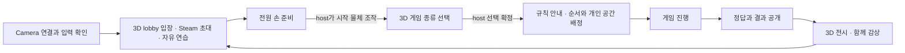

# 15. 3D hand tracking party game 설계

> 작성: 2026-08-28 · **설계 및 구현 계약** · 목표: Steam 친구 4명이 각자의 PC에서 플레이
>
> 이 문서는 새 제품 방향과 현재 구현 계약을 정의한다. 자동 검증과 외부 실기 검증을 구분한다. 기존 local 게임과 historical 2p 기록의 범위를 소급해서 바꾸지 않는다.

## 1. 만들려는 경험

친구와 같은 3D 공간에 들어와 걸어 다니고, 붓을 집고, 물감을 선택하고, webcam으로 손을 움직여 그린다. lobby에서 조작을 익힌 뒤 모두 손으로 준비를 확인한다. host가 시작하면 게임 종류를 고르고 함께 플레이한다. 결과는 방 안의 전시 공간에서 본다.

3D 공간은 이동과 물건 조작에 사용한다. 그림은 공간 안에 놓인 **평면 canvas**에 그린다. webcam 한 대를 VR의 위치·회전 추적 장치처럼 취급하거나 실제 손의 깊이를 정확히 측정한다고 가정하지 않는다. WASD가 몸의 이동을, hand tracking이 조준과 그림 입력을 담당한다.

### 사용자 요구와 설계의 대응

| ID | 요구 | 문서의 대응 |
|---|---|---|
| R1 | 4인 online, Steam 친구 초대 | §3 lobby 흐름, §8 권한 |
| R2 | 3D에서 자유 이동하며 조작·그림 연습 | §4 공간, §5 입력 |
| R3 | 시작 버튼도 손으로 함께 조작 | §3 전원 준비와 host 시작 분리 |
| R4 | host 시작 후 게임 종류 선택 | §3 `Lobby → ModeSelection → Playing` |
| R5 | 개인 종이를 남에게 보이지 않는 일렬 배치 | §4 개인 작업 공간, §6·8 비공개 규칙 |
| R6 | 첫 사람만 제시어, 다음 사람은 직전 그림 복사, 마지막은 키보드 답변 | §6 `RelayCopy` |
| R7 | 제한 시간 종료 시 자동 전달 | §6 완료·전송·다음 차례의 순서 |
| R8 | 옆의 붓·물감·굵기 조작 | §5 물체별 상호작용 |
| R9 | webcam이 없으면 phone을 PC camera로 사용 | [phone camera 설계](13_phone_camera_input.md) |
| R10 | 어울리는 게임을 추가할 수 있는 구조 | §7 채택 제안, §8 mode 경계 |

### 구현 전에 확인할 결정

| 결정 | 확인이 필요한 내용 | 현재 문서의 취급 |
|---|---|---|
| D1. 개인 canvas 배치 | 릴레이의 종이를 계속 들고 다닐지, 자기 구역 중앙에 거치할지 | **결정 완료.** `Docked`를 기본 상태로 하고, canvas handle을 pinch하면 손을 놓아도 avatar에 고정되는 `Carried`로 전환한다. 자기 구역 중앙의 dock를 pinch하면 `Docked`로 전환한다. 두 상태는 같은 drawing data·revision과 private recipient 권한을 유지한다. |
| D2. 그림을 보는 방식 | 직전 그림을 보면서 복사할지, 잠깐 본 뒤 기억으로 그릴지 | **결정 완료.** 첫 mode `RelayCopy`는 그림을 계속 보며 복사한다. 기억 방식은 필수가 아닌 후속 `MemoryCopy` 제안이다. |
| D3. 세부 조작·수치·추가 mode | pinch의 도구 선택 역할, 준비 유지 방식, 시간과 추가 mode의 우선순위 | fist drawing은 사용자 요구로 확정한다. 나머지 **제안**은 해당 기능 구현 전에 검토한다. 기존 코드의 설정값은 변경하지 않았다. |

## 2. 현재 구현과 목표의 차이

2026-08-31 source·Scene·test 조회 기준이다. 4p online runtime과 전용 Scene은 구현·자동 검증이 완료됐고, 실제 Steam 4계정·webcam·phone 기기 QA만 외부 검증으로 남아 있다.

| 영역 | 현재 확인한 내용 | 새 목표에서 필요한 일 |
|---|---|---|
| Python 입력 | `--camera`, camera listing/preview와 landmark를 local UDP로 전달 | 실제 phone camera 조합과 fist 실기 검증 |
| `Netplay3D` | WASD, world canvas, 도구 선택, 공유 그림 통신 | 기존 legacy 경로로 유지 |
| local `RelayQuiz` | 한 PC에서 2~4명이 화면을 넘겨 사용. 중간 사람은 5초 관찰 후 기억으로 그림 | 서로 다른 PC의 player identity, recipient별 비공개 view |
| 기존 `GameMode.Relay` | 여러 drawer가 같은 제시어를 알고 공유 canvas에 교대해서 그림 | 새 `RelayCopy`와 다른 규칙으로 유지·명명 |
| 손 버튼 | hover 표시와 pinch/release 실행 | 4개 ReadyPad와 host 전용 world action으로 구현 |
| 도구 | `ToolState`의 색·굵기·brush 선택 | 붓 거치대와 물감통을 같은 상태 변경에 연결 |
| 원격 표시 | body pose와 private/public drawing presenter를 분리 | 3 remote avatar와 RelayCopy/CoopMural privacy 계약으로 구현 |
| phone camera | camera index를 여는 구조. 제품 차원의 장치 선택·실기 호환성 확인은 남음 | camera 선택과 연결 안내, 실제 phone 검증 |
| Steam 4p RelayQuiz | `RelayQuizOnline` 전용 Scene·fixed 4 slots·private relay로 구현 | 실제 4계정/4device 연결 QA |

근거: [tracker](../PythonTracker/hand_tracker.py), [InputModeManager](../Assets/_CameraCoop/Scripts/Input/InputModeManager.cs), [PlayerController](../Assets/_CameraCoop/Scripts/Input/PlayerController.cs), [RelayQuizLogic](../Assets/_CameraCoop/Scripts/RelayQuiz/RelayQuizLogic.cs), [GameSession](../Assets/_CameraCoop/Scripts/Game/GameSession.cs), [RemotePresenter](../Assets/_CameraCoop/Scripts/Netplay/RemotePresenter.cs).

## 3. 입장부터 결과까지

### Steam 초대

- 3D lobby의 초대 물체를 손으로 선택하면 Steam invite overlay를 연다. 친구 선택·초대 수락은 Steam이 제공하는 화면에서 처리한다.
- Steam overlay 내부는 게임이 소유한 UI가 아니다. 여기는 mouse/keyboard 사용을 허용한다. 게임 물체의 손 조작과 구분한다.
- 입장한 친구에게 body와 이름, camera 준비 상태를 표시한다. Steam 계정과 게임의 player identity를 연결하며 표시 이름으로 권한을 판정하지 않는다.
- 4명까지 입장한다. 첫 목표의 정규 게임은 4명이다. 2p 개발 검증은 4p 완료 조건을 대체하지 않는다.
- camera 설정이 끝나지 않은 친구도 lobby에 들어와 이동하고 연결 안내를 볼 수 있다. 준비와 그림은 손 입력 확인 후 허용한다.

Steam lobby 참가와 실제 게임 연결은 서로 다른 단계다. 초대 수락 후 lobby 참가 결과, game connection, protocol 호환성을 각각 확인한다. 게임이 꺼진 상태에서 초대로 실행되는 경로는 별도 검증 대상이며 현재 지원 완료로 표시하지 않는다. [Steamworks 초대·lobby 문서](https://partner.steamgames.com/doc/features/multiplayer/matchmaking).

### 전원 준비와 host 시작 — 제안

중앙 시작 장치에 player별 손 표시 영역 4개를 둔다. 모든 사람이 같은 장치 주위에서 자신의 영역 위에 손 pointer를 올리면 각 영역이 채워진다. 준비 조작은 hover 유지이고, 그림 입력과 혼용하지 않는다.

1. 각 player가 camera 수신과 hand tracking을 확인한 뒤 자기 영역을 가리킨다.
2. 4명의 유효 hover가 함께 유지되면 준비를 확정한다. `readyDwellSeconds=1.0`은 첫 실험용 제안값이다.
3. 준비가 확정되면 손을 내려도 유지한다. host가 손을 옮겨 시작 물체를 누를 수 있어야 한다.
4. 준비 취소, 참가자 변경, camera stream 단절, session 변경은 준비를 해제한다. 재연결된 player의 예전 ready는 재사용하지 않는다.
5. host의 별도 손 조작이 있어야 `ModeSelection`으로 간다. 전원 준비만으로 게임을 자동 시작하지 않는다.

host는 서로 다른 4명의 준비만 센다. 한 사람이 양손을 올려도 한 명이다. client는 자기 준비만 요청할 수 있고 host가 현재 roster와 준비 세대를 검사한다. hover 유지 중 손이 사라지면 해당 진행량을 취소한다. **준비 확정 뒤 잠깐 손을 내리는 것과 camera 연결이 끊기는 것은 다르게 처리한다.**

### 게임 종류 선택

host가 시작하면 방 안의 mode 전시대가 열린다. 각 전시대에는 손으로 만질 수 있는 대표 물체, 짧은 규칙, 예상 진행 방식이 있다. 친구들은 돌아다니며 내용을 볼 수 있고 host만 선택을 확정한다. 투표 기능은 첫 구현의 필수 범위가 아니다.

선택 확정 후 참가자와 순서를 잠그고 규칙을 보여 준 다음 게임 공간에 배치한다. 이때 다른 player가 준비를 취소하거나 연결이 끊기면 시작하지 않고 lobby로 돌아간다. 게임이 끝나도 같은 Steam party를 유지해 다음 게임을 고를 수 있다.

## 4. 공간 구성

| 장소 | 할 수 있는 행동 | 3D가 필요한 이유 |
|---|---|---|
| 입구의 camera 안내대 | 장치 확인, phone 연결 안내, 손 범위 맞추기 | camera 준비 상태를 친구와 함께 확인 |
| 중앙 연습 canvas | WASD 이동, 손 조준, 선 그리기 | 서 있는 위치에 따라 canvas를 바라보고 접근 |
| 붓 거치대·물감통 | 붓 선택, 색 선택, 굵기 조절 | 도구 선택을 실제 공간의 행동으로 학습 |
| 시작 장치 | 4명이 손 준비, host 시작 | 모두 모여 게임을 시작하는 공동 행동 |
| mode 전시대 | 규칙 보기, host 선택 | 추가 게임도 동일한 입장 방식 사용 |
| 결과 전시 공간 | 처음부터 마지막까지 그림을 따라 걸으며 감상 | 변화 과정과 작성자를 함께 비교 |

### lobby camera 조작

현재 구현에서는 3D world action `CameraStartStop`을 제거하고, 오른쪽 위 Canvas `CameraPanel`의 `CameraToggle`을 camera 시작·종료의 유일한 mouse 입력으로 사용한다. 버튼은 상태 문구 위에 배치되며 `Off → 캠 켜기`, `Starting → 시작 중…`, `Receiving → 캠 끄기`를 표시한다. production pointer 경로는 버튼 영역의 왼쪽 press/release만 허용하고, answer input이 선택된 동안에는 동작하지 않는다.

나머지 13개 world action은 hand-only 계약을 유지한다. `Host`·`Invite`·`Leave`, game 선택·시작, 도구와 drawing 상호작용은 3D 맵 안에서 손으로 선택한다. camera 장치의 세부 설정 물체 `Refresh`·`Prev`·`Next`·`Preview`는 `CameraStation`에 둔다. 따라서 Canvas camera toggle을 3D 물체와 중복 배치하지 않는다.

### RelaySetupRoot transient 표시

`RelaySetupRoot`는 Scene에 직렬화되어 있지만 초기 상태와 안정된 online lobby에서는 inactive다. player join/leave 또는 host의 game start 이벤트가 발생할 때만 짧은 notice를 표시하고, notice 동안 다른 relay phase root를 숨긴다. notice는 `Time.unscaledDeltaTime` 기준 2.5초 뒤 자동으로 사라지며, 그 사이 수신한 최신 online view를 복원한다. `Handover`·`Drawing` 등 최신 phase가 이전 `Setup`보다 우선한다. setup 오류는 transient notice와 별개로 지속 표시한다.

제안 연습 순서는 **이동 → 손으로 물체 선택 → 붓 들기 → 물감 선택 → fist로 선 그리기 → 손 펴서 멈추기 → 굵기 변경 → 지우기**다. 확정된 D1의 canvas 전환과 D3의 나머지 공간·선택 동작을 구현 전에 적용한다. 각 행동을 성공하면 해당 물체에서 바로 반응하고, 연습을 마친 player를 다시 강제 tutorial에 가두지 않는다.

### 릴레이 개인 canvas — `Carried`와 `Docked`

- 4개의 작업 구역을 한 줄로 놓는다. player 순서와 구역 순서는 같다.
- 각 구역의 중앙에는 자기 canvas dock, 옆에는 자기 붓·물감·굵기 조절 물체를 둔다. canvas는 `Docked`로 시작한다.
- canvas handle을 pinch하면 canvas가 해당 avatar에 latched되어 `Carried`가 된다. 손을 놓아도 carry가 유지되며, player는 WASD와 look으로 이동·회전할 수 있다.
- `Carried` canvas를 자기 zone 중앙의 dock 위치로 가져가 dock 영역을 pinch하면 `Docked`로 돌아간다. 다른 player의 canvas나 다른 zone의 dock에는 전환할 수 없다.
- 두 상태는 동일한 canvas object의 drawing data와 revision을 사용한다. carry·dock 전환으로 복사본, 새 revision, 별도 기록을 만들지 않는다.
- 전환을 시작할 때 active stroke와 hand capture를 취소하고, open hand를 새로 확인한 뒤 drawing을 재무장한다. 전환 중 입력은 drawing으로 기록하지 않는다.
- canvas 이동·dock 전환은 owner만 수행한다. round abort·reset·disconnect 때 해당 canvas의 transform은 자기 dock으로 돌아가고 `Docked`로 초기화한다. drawing data·revision 폐기는 round reset 정책에 따르며 다음 round에 이전 private canvas를 재사용하지 않는다.
- 이전 그림은 **직전 player가 넘겨준 별도 read-only 종이**로 표시한다. 내가 그릴 빈 canvas와 구분한다.
- lobby와 gallery는 자유 이동한다. `RelayCopy` 중에도 `Carried` 상태에서는 WASD와 look을 허용하고, `Docked` 상태에서는 자기 zone 안에서 canvas를 바라보며 그린다. 도구까지 걸어갈 수 있지만 다른 사람의 구역을 가로막지 않는다.
- 가림판·종이 뒷면·카메라 배치는 분위기를 위한 장치다. 비공개 보장은 §8의 데이터 수신 권한으로 수행한다.

3D 물체에는 collider와 명확한 hover·선택 반응을 둔다. `World Space Canvas`는 이름·숫자·설명·답 입력 등 읽기 요소에 사용할 수 있다. 버튼을 작은 평면 UI로 옮겨놓는 것만으로 이 목표를 달성했다고 보지 않는다.

## 5. 손·이동·그림의 입력 계약 — 제안

### 현재 pinch와 목표 fist를 구분한다

현재 Python은 엄지 끝과 검지 끝 사이의 거리 비율로 `pinch`를 계산한다. 이 값만으로 “손 전체를 쥠”을 판정했다고 볼 수 없다. 첫 구현 전에 손을 펼침, pinch, fist를 실제 camera에서 구분해 확인한다. 기존 local/online 경로는 유지하고 새 입력 계약에만 fist 판정을 연결한다.

| 입력 | 역할 | 제한 |
|---|---|---|
| WASD | player 이동 | 답 편집·pause·구역 경계에서 제한 |
| mouse look | 시야 회전 | 기존 방식은 재사용 후보. look 시작 시 진행 중 선을 끊어 오입력을 방지 |
| 손 pointer | 물체 hover, canvas 위치 조준 | 한 손으로 모든 필수 행동 가능. 양손은 선택 사항 |
| pinch 후 release | 붓·물감·굵기·게임 물체 선택 | 기존 선택 동작의 재사용 제안. 다른 대상에서 놓으면 취소 |
| fist 유지 | 선택한 붓으로 canvas에 그리기 | 올바른 canvas, 쓰기 권한, fresh hand가 모두 필요 |
| 손 펼침 | 선 종료와 재무장 | 다음 검출 위치까지 긴 선으로 연결하지 않음 |
| hover 유지 | 공동 준비 | 시작 장치에서만 사용. canvas를 잘못 그리지 않음 |
| keyboard | 이동, 답·문장 편집 | 텍스트 편집 중 WASD·look·그리기 차단 |

fist에서 검지 끝이 가려져도 조준이 튀지 않도록 손바닥 기준점을 사용한다. 어느 landmark 조합을 쓸지는 현재 palm pointer와 실측을 대조해 확정한다. pointer는 camera ray로 world collider를 검사하고, canvas hit만 `CanvasSurface`의 normalized 좌표로 바꾼다. 실제 손의 z를 player 이동이나 붓의 물리 깊이로 직접 사용하지 않는다.

### 도구 동작

| 물체 | 손 조작 결과 | 데이터·점유 규칙 |
|---|---|---|
| 붓 거치대 | 붓을 선택하면 player의 도구로 장착 | 손을 펴도 장착은 유지. 명시적 반납·교체로 해제 |
| 물감통 | 장착한 붓의 색 변경 | 빈손으로 선택하면 붓부터 들라는 반응. 물감 소모·혼색은 첫 범위에서 제외 |
| 굵기 조절 물체 | 가는 붓/중간 붓/굵은 붓 또는 손 slider | 기존 `ToolState` 범위 재사용. 선택값을 붓과 preview에 표시 |
| 지우개 | 기존 삭제 방식으로 전환 | 현재 구현이 stroke 삭제라면 그대로 안내. pixel 일부 지우기로 표현하지 않음 |
| 되돌리기 물체 | 자기 작업의 마지막 변경 취소 | 자기 그림에만 적용. 전달받은 원본과 확정된 기록 변경 금지 |
| 전체 지우기 물체 | 자기 작업만 초기화 | 의도 확인 동작 필요. 공개 연습 공간의 남의 그림은 지우지 않음 |

붓은 player별 도구로 시작한다. 다른 사람이 훔쳐서 차례를 방해하는 기능은 넣지 않는다. 원격에는 선택 도구·색처럼 공개해도 되는 상태만 보낸다.

### 한 번의 손 동작이 두 작업을 하지 않게 한다

물감 선택을 마친 손이 닫힌 채 canvas 위로 이동해도 즉시 선을 그리지 않는다. 대상 변경·도구 변경·차례 변경·pause·camera 재연결 때 capture를 취소하고, fresh open hand를 다시 확인한 뒤 새 drawing을 허용한다. canvas 밖으로 나가면 선을 끝내고 재진입 시 새 선을 만든다. ray가 가림 물체를 통과해 뒤의 canvas를 쓰지 않게 한다.

그림을 그릴 때 `Carried` 상태에서는 WASD와 look을 계속 허용한다. `Docked` 상태에서는 자기 zone 안의 이동과 손 조준을 함께 허용한다. 두 상태 모두 fist drawing을 사용하며, `Move`와 `Drawing`을 항상 배타적으로 처리하지 않는다.

### 2D와 mouse를 남겨야 하는 범위

camera가 켜지지 않으면 손으로 camera 시작 버튼을 누를 수 없다. camera 선택·권한·시작·실패 복구, Steam overlay, 종료 같은 복구 행동에는 mouse/keyboard를 허용한다. 게임 시작·mode 선택·물감·그림의 대체 입력으로 확대하지 않는다. 답 입력창은 3D 작업대에 둘 수 있지만 실제 문자와 한글 IME 편집은 keyboard를 사용한다.

## 6. 첫 게임: `RelayCopy` — 그림 전달 퀴즈

### 규칙

4명이 한 줄의 순서로 진행한다. P1만 제시어를 받고 그린다. P2는 P1의 완성 그림을 보며 자기 빈 canvas에 다시 그린다. P3는 P2의 완성 그림만 보고 다시 그린다. P4는 P3의 그림만 보고 답을 입력한다. 다른 사람은 현재 그림과 제시어를 볼 수 없다.

| 차례 | 해당 player에게 보이는 정보 | 허용 행동 | 다음 단계 |
|---|---|---|---|
| P1 제시어 | P1에게만 단어 | 읽기 | 제시어 표시 종료 후 그리기 |
| P1 그림 | 자기 canvas와 도구 | fist drawing | 완료·시간 만료 시 그림 확정 |
| P2 복사 | P1의 frozen 그림 + 빈 자기 canvas | 그림을 보며 다시 그리기 | 자기 그림만 확정 |
| P3 복사 | P2의 frozen 그림 + 빈 자기 canvas | 그림을 보며 다시 그리기 | 자기 그림만 확정 |
| P4 답변 | P3의 frozen 그림 + 답 입력 | keyboard 편집, 손으로 제출 | 제출·시간 만료 시 판정 |
| 결과 | 전원에게 제시어·확정 답·판정 | 함께 확인 | gallery |
| gallery | P1·P2·P3 그림을 순서대로 공개 | 이동하며 비교 | host가 lobby로 복귀 |

P2와 P3에게 참고 그림은 drawing 시간 동안 유지한다. 이것이 기존 local 기억 방식과의 차이다. 작업 canvas를 이전 그림으로 채워 이어 그리는 방식도 아니다. 참고 그림과 자기 그림은 서로 다른 데이터다.

### 시간과 판정 — 제안값

| 항목 | 초기 제안 | 근거·제약 |
|---|---:|---|
| P1 제시어 표시 | 5초 | 기존 local 기본값 재사용 후보 |
| P1·P2·P3 그리기 | 각각 60초 | 기존 drawing 기본값 재사용 후보. 복사 차례에서 임의로 단축하지 않음 |
| P4 답 입력 | 30초 | 기존 기본값 재사용 후보 |
| 전송 대기 상한 | 10초 | 진행 중 2p 설계의 상한을 재사용하는 제안. gameplay 시간과 분리 |

시간은 host가 관리한다. client의 남은 시간은 표시용이다. 그림 완료와 시간 만료가 동시에 발생해도 한 차례에 한 번만 확정한다. 명시적 완료 버튼은 조기 제출용이며, 누르지 않아도 시간이 끝나면 자동 전달한다.

답 판정은 기존 `GuessJudge`의 whitespace 제거·case 정규화·완전 일치 방식이 재사용 후보이다. 빈 답은 오답이다. 유사어·오타 허용·점수 공식은 별도 합의 없이 추가하지 않는다. 첫 범위의 결과는 팀 정오 판정과 그림 변화 감상이다.

### 자동 전달의 실제 순서

1. host가 차례 종료를 확정하고 해당 player의 drawing 입력을 잠근다.
2. 마지막 활성 선을 끝내고 최종 snapshot을 고정한다. 이후 도구 조작으로 내용이 바뀌지 않아야 한다.
3. host가 snapshot의 owner·차례·크기·내용을 검증하고 기록한다.
4. 다음 player에게만 참고 그림을 전달한다. 도착·검증·표시 준비를 확인한다.
5. 이전 화면의 capture와 presentation을 정리하고 새 차례를 연다. **다음 player의 시간은 그림이 준비된 후 시작한다.**

전송 중에는 그림을 복사하는 시간을 소비하지 않는다. 네트워크 오류를 빈 그림 제출로 처리하지 않는다. 정상 빈 그림은 유효한 빈 snapshot으로 구분한다. 응답 없는 player 때문에 무한 대기하지 않도록 상한 후 오류를 알리고 round를 중단한다.

P4의 입력 내용은 답변 차례에 host로 private 동기화하고, 명시적 제출·시간 만료 때 최종 편집본을 확정하는 절차가 필요하다. IME 조합 중 문자는 확정 답에 넣지 않는다. 마지막 글자 누락과 늦은 제출은 별도 검증한다.

### 기다리는 player

남의 종이 대신 자신의 순서, 남은 시간, 가벼운 반응 물체를 볼 수 있다. 기다리는 동안 손을 내려도 다른 사람의 timer는 멈추지 않는다. 비밀 그림을 유추할 수 있는 붓 끝 경로, 종이 thumbnail, 실시간 손 궤적은 공개하지 않는다. 음성이나 외부 화면 공유로 정답을 알려주는 행위까지 기술적으로 막는다고 약속하지 않는다.

## 7. 추가 게임 채택 제안

아래 이름은 이 프로젝트의 임시 mode ID다. 원작의 UI·asset·문구를 복제하는 계획이 아니다. **규칙의 참고점과 이 프로젝트에서 새로 제안한 부분을 구분한다.**

| 순서 | mode | 참고한 구조 | 이 프로젝트에 적용할 규칙과 3D 행동 |
|---|---|---|---|
| 1 | `RelayCopy` | 사용자 요구. Gartic Phone의 `SANDWICH`도 글→그림 연속→마지막 설명 구조 | §6의 private 4인 전달. 결과를 일렬로 전시 |
| 2 | `MemoryCopy` | `KNOCK-OFF`의 그림 복제·시간 압박 | **우리 제안:** 직전 그림을 5초 본 뒤 가리고 복사. 기존 local 기억 규칙 재사용. 차례별 시간 단축은 첫 범위에 넣지 않음 |
| 3 | `CoopMural` | `COMPLEMENT`의 밑그림 완성, `CO-OP`의 공동 그림 | 중앙 공개 canvas에 P1→P2→P3→P4 순서로 추가. 큰 붓을 넘기는 물체 조작. 이전 사람의 선 삭제 금지 |
| 후속 | `WordPictureRelay` | `NORMAL`의 문장·그림 교대 | P1 문장→P2 그림→P3 해석 문장→P4 그림. 이전 결과만 공개. typing 비중이 높아 우선순위를 낮춤 |

참고한 mode 구조는 [Gartic Phone 공식 preset 설명](https://garticphone.com/en/lobby)에서 확인했다. 관찰 시간, 4인 순서, 물체 조작과 우선순위는 이 프로젝트에 맞춘 제안이다.

`CoopMural`은 초기 단어를 모두에게 공개하고 최종 그림을 함께 완성하는 mode다. active writer는 P1→P2→P3→P4 순서로 한 명씩만 허용한다. 차례가 끝난 layer는 freeze되어 이후 writer가 지울 수 없고, P4 완료 시 네 layer를 전원에게 공개한다. 다른 사람은 이동하며 감상한다. 자동 정답 판정이나 미술 실력 점수는 넣지 않는다. `WordPictureRelay`는 한 chain·네 차례로 시작하고, 결과에서 모든 문장·그림을 공개한다. 동시 다중 chain은 별도 확장이다.

`ANIMATION`은 frame 편집·재생과 결과 저장이 추가로 필요하므로 보류한다. 텍스트만 이어 쓰는 게임, 실제 깊이 추적을 요구하는 공중 3D 조각, 손 속도 경쟁이 핵심인 mode도 첫 범위에서 제외한다. camera 지연과 손 인식 편차가 게임 승패를 과도하게 결정하지 않게 한다.

## 8. 구현 시 지켜야 할 경계

### 공통 책임

| 책임 | 담당하는 내용 | 기존 코드와의 관계 |
|---|---|---|
| Party 진행 | Steam roster, 준비, host 선택, lobby↔게임 | `SteamTransport`·초대 경로 재사용 후보 |
| World 표시 | body 위치, 도구 표시, 작업 구역, 물체 반응 | `PlayerController`·world ray 경로 확장 |
| Mode 규칙 | 순서, 시간, 쓰기 권한, 볼 수 있는 정보, 결과 | 기존 guessing game과 새 relay의 의미를 분리 |
| 그림 정본 | owner, canvas, 차례, revision과 normalized strokes | `CanvasDrawingData`·`CanvasDrawingPresenter` 재사용 후보 |
| 입력·복구 | camera 상태, 손 gesture, typing, capture 취소 | `InputModeManager`·`HandInputRouter`와 연결 |

이는 역할 구분이며 새 class가 이미 존재한다는 뜻이 아니다. 필요한 만큼만 분리한다. 첫 mode부터 범용 plugin framework를 만드는 것은 요구하지 않는다. 새 mode를 넣을 때 camera·Steam 초대·붓을 다시 구현하지 않는 정도의 공통 경계를 유지한다.

### 2p prototype과 4p roster를 분리한다

진행 중인 `OnlineRelayQuiz`는 host와 단일 remote client identity, 단일 상대 view를 전제로 한다. `MaxPlayers`만 4로 바꾸거나 local `RelayQuizLogic`이 4명을 센다는 사실만으로 4p online을 구현했다고 볼 수 없다.

새 4p session은 `sessionId`, `rosterGeneration`, host identity와 고정 slot 4개를 가진 roster snapshot을 기준으로 한다. 각 slot은 `playerIndex 0..3`, 실제 Steam identity, 연결·준비 상태를 보유하고 표시 이름과 분리한다.

- Setup에서만 roster에 player를 추가한다. game start 시 slot 순서와 generation을 잠근다.
- 명령의 transport sender가 해당 slot의 identity인지 매번 확인한다. client가 보낸 `playerIndex`만 신뢰하지 않는다.
- 시작 뒤 새 peer는 protocol handshake에서 거부한다. Steam lobby의 join 가능 flag만으로 보안을 완료했다고 보지 않는다.
- 이탈한 slot을 같은 round의 새 참가자로 채우지 않는다. 재초대는 새 session 또는 새 roster generation으로 시작한다.
- 모든 client가 같은 잠긴 roster를 확인한 뒤 mode와 round를 시작한다.

### recipient별 정보 계약

host process는 authoritative state를 위해 secret과 그림 정본을 가진다. **host player의 화면**은 이 내부 state를 직접 표시하지 않고 아래 local slot 권한만 적용한다.

| 정보·명령 | sender | 허용 recipient | 금지 대상·폐기 시점 |
|---|---|---|---|
| lobby roster·ready·mode·공개 timer | host 또는 자기 ready를 보내는 해당 slot | 잠긴 party 전원 | 이전 `rosterGeneration`은 폐기 |
| 제시어 | host | P1의 local view만 | P2~P4, lobby metadata, log에 없음. P1 WordReveal 종료 뒤 client 표시·cache 폐기 |
| active drawing 입력 | 현재 owner slot | host process만 | 다른 player에게 실시간 stroke·cursor·brush tip을 보내지 않음 |
| P1 완성 그림 | host | P2만 | P1·P3·P4의 client cache에 없음. P2 차례 종료 뒤 폐기 |
| P2 완성 그림 | host | P3만 | P1·P2·P4에 없음. P3 차례 종료 뒤 폐기 |
| P3 완성 그림 | host | P4만 | P1~P3에 없음. 답 확정 뒤 폐기 |
| transfer 준비 확인 | 그림을 받은 destination slot | host만 | 다른 transfer ID와 늦은 ack는 거부 |
| 답 draft·최종 제출 | P4 | host만 | Reveal 전 P1~P3에 없음. 판정 뒤 draft 폐기 |
| abort | host | 잠긴 party 전원 | reason·generation만 전송하고 secret·partial 그림은 공개하지 않음 |
| Reveal·Gallery snapshot | host | 잠긴 party 전원 | `Reveal` 전 전송 금지. 다음 game/session 시작 시 client cache 폐기 |

recipient 검증은 메시지 종류뿐 아니라 `(sessionId, rosterGeneration, roundId, turnId, ownerSlot, revision)`을 함께 검사한다. player가 이전에 자기 그림을 봤다는 기억까지 지울 수는 없지만, 차례 뒤 renderer·입력·client cache에서 접근 가능한 데이터는 제거한다.

### 차례 전달과 gallery 계약

한 번의 전달은 `(sessionId, roundId, turnId, sourceSlot, destinationSlot, drawingRevision)`으로 식별한다. host가 owner의 확정 drawing을 검증한 뒤 destination 한 명에게 보내고, 같은 ID의 `Prepared` 확인을 받아야 destination의 timer를 시작한다.

- 중복 `Prepared`는 한 번 처리하고, 다른 revision·destination·늦은 ack는 거부한다.
- transfer timeout은 빈 그림 제출로 바꾸지 않고 host가 round를 abort한다.
- disconnect와 완료·ack가 경합하면 host가 확정한 새 abort generation을 우선한다. 진행 중 transfer와 늦은 완료를 폐기한다.
- 어떤 player가 이탈해도 첫 범위에서는 round 전체를 abort한다. turn 재배정과 host migration은 하지 않는다.

Gallery 공개 시점에만 host가 `GallerySnapshot`을 전원에게 보낸다. snapshot은 session·round·generation과 `drawingIndex`, 고정 `ownerPlayerIndex`, drawing revision, immutable drawing payload로 된 3개 항목을 순서대로 가진다. display name은 잠긴 roster에서 찾는다. 다음 round·mode·session을 시작하면 모든 client가 이전 Gallery와 private transfer cache를 지운다. 이는 구현할 data contract의 이름이며 현재 type이 이미 존재한다는 뜻이 아니다.

### 그림의 비공개는 데이터 단계에서 보장한다

- 기존 `NetSession`은 공유 stroke를 전원에게 중계하고 late join에 그림 snapshot을 전달한다. `StrokeGate`만 추가해서 private relay에 사용할 수 없다. `Carried`와 `Docked`는 canvas transform만 바꾸고 이 private data contract는 바꾸지 않는다.
- `RelayCopy`는 drawing 중 다른 client에 stroke를 broadcast하지 않는다. 완성된 snapshot을 host가 보관하고 현재 허용된 수신자에게만 전달한다.
- 명령과 snapshot에 session, round, turn, canvas, owner, revision을 연결한다. 실제 transport sender가 요청 owner인지 검사하고 이전 세대·중복 요청은 거부한다.
- Steam lobby metadata, 공개 roster, 로그, remote cursor, thumbnail에 제시어나 비공개 그림을 넣지 않는다. raw camera 영상과 landmark도 다른 게임 참가자에게 보내지 않는다.
- pose 동기화에서 공개할 값은 drawing surface와 독립된 body root 위치·yaw·기본 locomotion state로 제한한다. private 차례에는 `cursor`, canvas normalized coordinate, pinch/fist 상태, 붓 끝, stroke ID·손 궤적을 보내지 않는다. 기존 shared cursor packet을 body pose로 재사용하지 않는다.
- 보이지 않아야 하는 client에는 데이터가 없어야 한다. 해당 client의 renderer만 끄거나 종이를 뒤집는 것으로 완료 처리하지 않는다.
- host가 판정과 전달을 맡으면 host process에는 정본이 존재한다. 변조된 host나 메모리 분석까지 막는 보안은 첫 범위 밖이다.

snapshot에는 Unity object reference를 넣지 않는다. normalized stroke 배열과 style을 deep copy하고 입력 범위·유한수·stroke 수·point 수·brush ID·총 byte 수를 검증한다. 큰 그림은 reliable chunk로 보내며 빠진 chunk·중복·잘못된 순서를 검사한다. 기존 shared protocol에 의미를 섞지 않고 game/protocol 호환성을 확인한다.

### 이동과 가시성

lobby의 위치·방향은 그림 데이터와 별도로 동기화한다. lobby의 연습 그림은 공개 데이터이며 private relay 기록과 저장 공간을 공유하지 않는다. 모드를 바꾸면 이전 모드의 그림·권한·입력 capture가 남지 않아야 한다. camera ray의 최대 거리·가림 검사와 player의 작업 구역을 함께 적용한다.

### 참가·이탈·실패 — 첫 범위 제안

| 사건 | 동작 |
|---|---|
| 게임 중 새 참가 | 진행 중 private round에 넣지 않음. lobby에서 다음 게임 대기 안내 |
| active drawer의 손 상실 | 활성 선 종료. 짧은 유실과 장치 단절을 구분하고 host가 해당 차례 pause 처리 |
| 읽기·답 편집·대기 중 손 내림 | 그 이유만으로 timer를 멈추지 않음 |
| camera stream 단절 | 준비 해제, 관련 입력 차단, 연결 복구 안내 |
| active player의 focus 상실 | private 화면 숨김, host가 해당 차례 pause |
| 복구 | fresh 입력과 새 open 상태 확인 후 명시적 재개. 오래된 gesture로 제출·시작하지 않음 |
| player 이탈·전송 실패 | host가 새 abort generation을 전원에게 보내 이번 round 전체 중단. 기록을 정상 완료로 공개·채점하지 않고 재초대 안내 |
| host 종료 | session 종료. 자동 host migration·중간 round 복원은 첫 범위 밖. 남은 client는 local private cache 폐기 |

pause는 무제한으로 친구를 붙잡는 기능이 되면 안 된다. 제한 시간과 중단 방법은 D3에서 확정한다. 중단·종료·camera 복구는 손 입력이 없어도 접근 가능해야 한다. 새 게임은 새 session/round 세대로 시작하고 이전 secret·그림·제출 요청을 다시 쓰지 않는다.

## 9. 범위와 다음 문서

## 9-1. World label과 점프 구현 기준 — 2026-08-31

조작 대상의 문자는 `WorldLabelBillboard`가 player camera를 향하도록 갱신한다. 대상은 13개 `WorldActionInteractable`, 4개 ReadyPad, 4개 brush/tool label로 제한한 총 21개다. title·player name·camera station·brush header·reference·mural·gallery 같은 건축·안내 표지는 billboard를 붙이지 않고 intended front에 고정한다. 이렇게 해야 사선 시야에서 조작 label은 읽히고, static sign은 공중에 떠 보이거나 거대한 UI처럼 회전하지 않는다. lobby title은 `LobbyDesk` front facade에 mount한다. Scene 검증 계약은 `34 TextMesh / 21 WorldLabelBillboard / 13 static / static presenter 0`이다.

`ModalFirstPerson` 이동은 WASD와 mouse look에 grounded `Space` jump를 추가한다. `CharacterController.isGrounded`와 rising edge를 함께 확인하고 `jumpHeight` 설정값으로 impulse를 계산한다. `Blocked`·타이핑·포커스 상실에서는 이동과 jump를 차단하며, floor button/structure collider는 통로를 막되 점프로 넘을 수 있다. 검증 결과와 미검증 device 범위는 [검증 계획 §11-4](05_test_plan.md#11-4-world-label-readability--grounded-jump-final-verification--2026-08-31)에 기록한다.

이번 문서는 구현 요구와 결정 사항을 갱신한 것이다. `RelayQuizOnline` Scene, world gesture, phone camera 선택 경로, Steam 4p contract, `RelayCopy`/`MemoryCopy`/`CoopMural`은 구현·자동 검증됐다. 실제 Steam 4계정, webcam hand tracking, phone/Camo/Continuity Camera 실기는 외부 검증 대기다. 세부 상태는 [구현 순서와 완료 기준](16_implementation_roadmap.md)에 기록한다.

기존 [품질 기준](../QUALITY_CHECKLIST.md)은 그대로 유지한다. 문서 검토를 기능 구현 점수로 환산하지 않는다. 각 기능의 실제 테스트·성능 근거·4인 Player 관찰 결과를 남겨야 한다.
